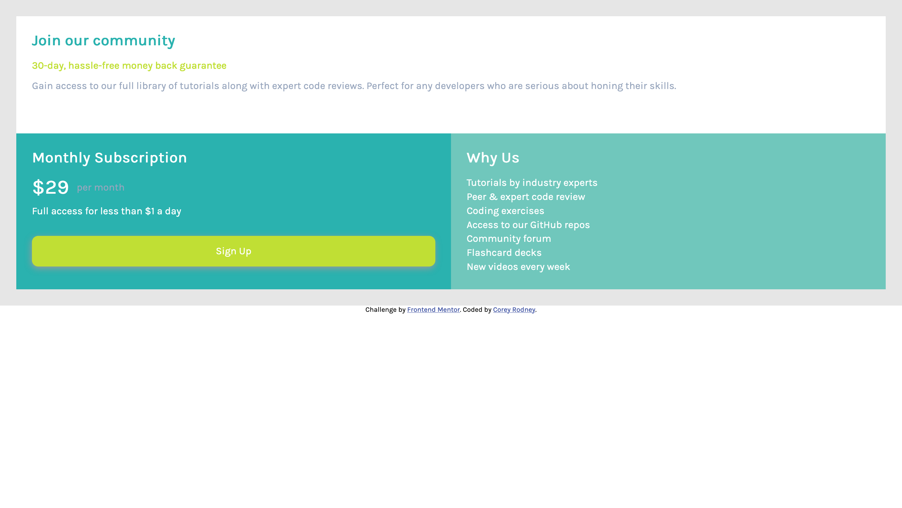

# Frontend Mentor - Single price grid component solution



## Table of contents

- [The challenge](#the-challenge)
  - [Screenshot](#screenshot)
  - [Links](#links)
- [My process](#my-process)
  - [Built with](#built-with)
  - [What I learned](#what-i-learned)
  - [Continued development](#continued-development)
  - [Useful resources](#useful-resources)
- [Author](#author)

### The challenge

Users should be able to:

- View the optimal layout for the component depending on their device's screen size
- See a hover state on desktop for the Sign Up call-to-action

### Screenshot


### Links

- Solution URL: [Add solution URL here](https://your-solution-url.com)
- Live Site URL: [Add live site URL here](https://your-live-site-url.com)

## My process
The first challenge I complete on this platform I didnt use the mobile first and it was a tough challenge. This time around I did this challenge completly mobile first and it was a blast to learn. I create the skeleton for the challenge with all the color font etc and then work on the desktop build after the mobile build is fully complete.
### Built with

- Semantic HTML5 markup
- CSS custom properties
- Flexbox
- CSS Grid
- Mobile-first workflow


### What I learned

This challenge was fun as it was the first time I use CSS Grid. CSS Grid is a lot different from flexbox and one of the funnies thing is tying ```display: grid;``` and nothing happen. Even though this is a code challenge i gained some knowledge on my googling skills as well. Found some new resources on how to crate grid, how to size them, how to minipulate the locations of each grid as well. I still have much more to learn but so far this was a great starting point for me. 

I also use arid within my code. Learning more about accessability is amaizing and I look forward to making all my work accessable for everyone.

### Continued development

Moving on from this challenge I'll be putting in more work learning CSs Grid and even implementing some flexbox within the grid as well. I'll be trying out some Javascript for the first tiime hopefully I can learn something cool for the next challenge.

### Useful resources

- [MDN WAI-ARIA Roles](https://developer.mozilla.org/en-US/docs/Web/Accessibility/ARIA/Roles) - This is where i learned about the roles for aria within my code. Great resouce for anyone looking to make their website accessable.

- [CSS Tricks - Grid layout](https://css-tricks.com/snippets/css/complete-guide-grid/) - For beginners this is a great resource if you want to learn css grid


## Author

- Frontend Mentor - [@dellannie](https://www.frontendmentor.io/profile/dellannie)
- Twitter - [@whatzupcorey](https://www.twitter.com/whatzupcorey)
